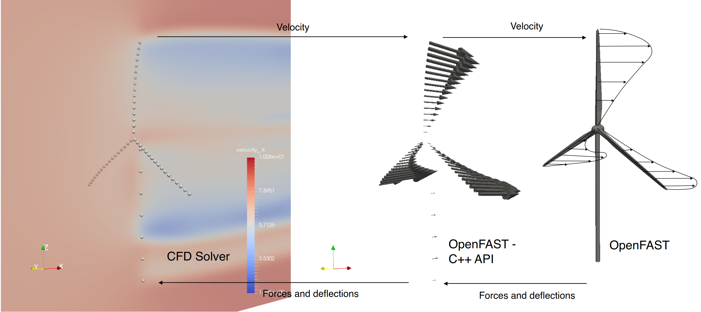

# preCICE-Openfast Adapter

[OpenFAST](https://openfast.readthedocs.io/en/dev/index.html) is a multi-physics engineering tool for the aero-servo-elastic simulation of wind turbines. It includes modules for the modeling of aerodynamic, structural, and electrical behaviour of on- and offshore wind turbines.

This project aims to couple OpenFAST with CFD simulation tools with the coupling library [preCICE](https://precice.org/). Therefore, a preCICE-OpenFAST Adapter is being developed. The Adapter calls OpenFAST via the C++ API to drive the turbine simulation. Additionally, it calls the preCICE library to communicate and coordinate with CFD solvers like OpenFOAM.

As a first test case, the Adapter should be able to perform the coupled simulation of a single NREL5MW onshore turbine. OpenFAST calculates the forces and internal state of the turbine, while OpenFOAM is used as CFD solver to compute the inflow (see image).


Source: [OpenFAST documentation](https://ganesh-openfast.readthedocs.io/en/latest/_images/actuatorLine_illustrationViz.pdf), visited on 07.11.2023

## Dependencies

- [OpenFAST v3.5.0](https://openfast.readthedocs.io/en/main/source/install/index.html)
- [OpenFOAM v2206](https://www.openfoam.com/news/main-news/openfoam-v2206)
- [preCICE v3.0.0](https://precice.org/installation-overview.html) by installation from source from the [develop](https://github.com/precice/precice) branch
- [preCICE-OpenFOAM](https://precice.org/adapter-openfoam-get.html) adapter by installation from source from the [develop](https://github.com/precice/openfoam-adapter) branch
- [turbinesFoam](https://github.com/turbinesFoam/turbinesFoam), an OpenFOAM library to simulate wind turbines using the actuator-line method

## Run a simulation

- Install the adapter
- Select a [simulation case](https://github.com/LeonardWilleke/openfast-adapter/tree/main/cases)
- Compile the necessary scripts
- Run the coupled simulation

Instructions on how to compile the files and run the simulation are given in each case.

## Installation

Clone the repository and switch to the source directory:

```bash
git clone https://github.com/LeonardWilleke/openfast-adapter.git
cd openfast-adapter/src
```

We use **cmake** for the compilation by invoking a make script:

```bash
bash Allmake
```

The adapter is built locally in the `bin` folder. To make it accessible on the whole system, you need to export the installation path after compilation.

Open the `.bashrc` file

```bash
cd ~
nano .bashrc
```

and add the following line:

```bash
export PATH={path_to_repository}/openfast-adapter/bin:$PATH
```

Now run

```bash
source .basrhc
```

and restart your terminal.

You're good to go! If you want to re-compile the adapter, make sure to clean the old installation first by running `src/Allclean`.
