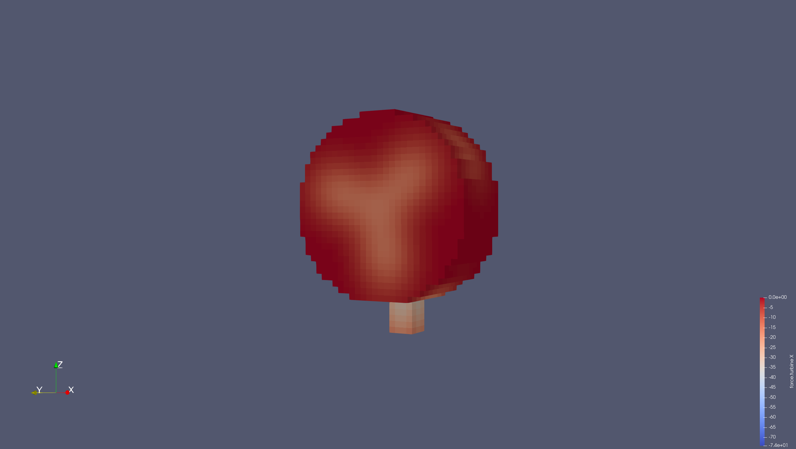
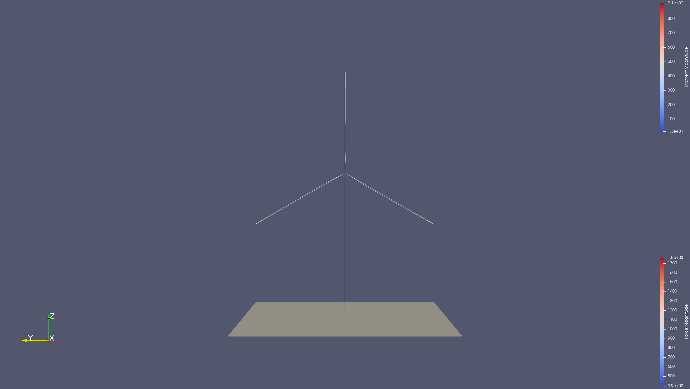

## Setup

This case couples a single NREL5MW turbine in OpenFAST to a dummy turbine in OpenFOAM. The two models don't match in dimension but are used to show the concept.

The fluid solver writes `Velocity` from the flow to the solid solver. Ideally, the solid solver would return the variable `Force`, which is currently not possible with the OpenFOAM adapter. For now, the force data is sent to the Fluid as `Pressure`. This leads to a wrong calculation, but is done to explore the data exchange and mapping between the simulation tools.

An open challenge is the mapping between the volume-based cellSet `turbine` in OpenFOAM and the line-based turbine model in OpenFAST (see pictures below).

## Available solvers

- *openfast*: A first coupled code `coupled-openfast`, which calls both the preCICE and OpenFAST API. The input file `cDriver.i` specifies the OpenFAST `.fst` file and some simulation metadata.
- *fluid*: A OpenFOAM simulation of the flow field. The turbine is represented via the actuator-line method with the OpenFOAM library `turbinesFoam`.

## Running the Simulation

Open two separate terminals and start both participants by calling:

```bash
cd openfast
./run.sh
```

and

```bash
cd fluid
./run.sh
```

## Visualization

**OpenFOAM**

To visualize the whole flow region, go to the `fluid` Terminal and type:

```bash
paraFoam
```

The aerodynamic effect of the turbine on the flow field becomes visible.

To visualize only the subregion where the turbine is modeled, use the commands:

```bash
foamToVTK -cellSet turbine
paraFoam
```

Now use Paraview to open the file `turbine.vtm.series` in the `VTK` subfolder. 

The aerodynamic effect of the single blades on the near flow field becomes visible.



**OpenFAST**

OpenFAST generates VTK files to investigate the turbine mesh. The files are stored in the same folder as the `.fst` file. Starting from the `openfast` terminal, type:

```bash
cd ../../../input/nrel5mw
paraview
```

Now use Paraview to open all files in the `vtk` subfolder. You should see the line representation of the turbine as used by the Actuator Line Method.



## License and attribution

Parts of this code were reused from a [OpenFAST C++ API example](https://github.com/OpenFAST/openfast/tree/v3.5.0/glue-codes/openfast-cpp/src/FAST_Prog.cpp), which is licensed under the [Apache 2 license](https://github.com/LeonardWilleke/openfast-adapter/thirdparty/LICENSE.txt).
